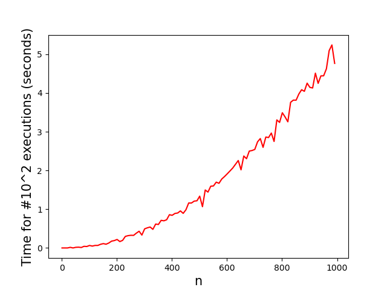

# Time complexity for complicated code

Sometimes, for complicated code, it isn't immediately obvious what its time complexity is. Consider the following example.

    # this function replaces zeroes in a list with the argument "replace_with"  
    def replace_zeroes(lst, replace_with):
        output_lst = []
        for element in lst:
            if element == 0:
                output_lst.append(replace_with)
            else:
                output_lst.append(element)

        return output_lst

    # this functions finds duplicate elements in a list
    def find_duplicates(lst):
        for index1 in range(len(lst)):
            for index2 in range(len(lst)):
                if index1 != index2 and lst[index1] == lst[index2]:
                    print(f"Found a duplicate in positions {index1} and {index2}!")

    # make a list to test the functions on
    lst_with_zeroes = [0,1,3,4,2,5,6,9,1,8,7,0]

    # first we replace zeroes with two's
    lst_without_zeroes = replace_zeroes(lst_with_zeroes, 2)

    # then we search for duplicates
    find_duplicates(lst_without_zeroes)

In the above code, we define two functions. The first, `replace_zeroes`, takes a list and creates copy of it where all zeroes are replaced by some other number, in this case two. The second, `find_duplicates`, searches through a list for identical pairs. We apply both these functions to the `lst_with_zeroes`.

In this case the input size, $$n$$, is equal to the length of the list that we start with. The list in the example has only $$n=12$$ elements, so the code takes only a short time to run. But what would happen if we run this same code for larger input lists? How long would it take to run the code? What can we say about the time complexity?

To start, we can try to analyze the time complexity of the individual functions. The `replace_zeroes` function loops over the entire list once, replacing zeroes when it finds them. This means it has to check for all $$n$$ elements in the list whether they are zero. Since this basic computing step is repeated $$n$$ times, we can deduce that `replace_zeroes` has a time complexity of $$O(n)$$.

Next, let's look at the `find_duplicates` function. Given an element in the list, it searches through all $$n$$ elements to see whether they are identical to the given element. This takes $$n$$ steps. However, it has to repeat this process again for every element in the list! Checking all possible pairs means the function makes $$n * n$$ comparisons between elements. We can conclude that `find_duplicates` has a time complexity of $$O(n^2)$$.

Now we know the time complexity for each function individually. But what is the time complexity for running them one after the other? Is it $$O(n)$$, like the `replace_zeroes` function? Or is it $$O(n^2)$$, like the `find_duplicates` function? Maybe something in between? Or is it entirely different altogether?

In order to figure out these questions and more, it seems that we need some rules that will allow us to calculate time complexity. We will explore these rules in the next section. When you learn how to calculate time complexity of complicated code, you can quickly tell how efficient your code is, without even running it! In the meantime, we can still fall back on the familiar stopwatch method. Below, there is a graph of how long it takes to `replace_zeroes` and `find_duplicates` as a function of $$n$$. Do you recognize the shape of the graph?

{: width="400px"}

That's right! It looks just like the graph we saw for the $$O(n^2)$$ example. The time increases quadratically as a function of $$n$$.

If you think about it for a bit, this maybe makes sense. The time taken to run both functions, is equal to the time taken to run `replace_zeroes` plus the time taken to run `find_duplicates`. So the resulting graph is just the sum of the $$O(n)$$ and $$O(n^2)$$ graphs. As $$n$$ gets bigger, the contribution from `replace_zeroes`, with its $$O(n)$$ complexity, becomes small compared to the contribution from `find_duplicates`. That means the resulting graph will effectively look like it's just the $$O(n^2)$$ graph again! For the mathematically inclined, there is another way to think about this. Adding a linear function and a quadratic function gives another quadratic function. Regardless of your reasoning, the conclusion is that the total time complexity for this code is $$O(n^2)$$.

If that reasoning feels like it went a bit fast for you, don't worry! The next section takes the process of calculating the time complexity, and breaks it up into small, simple steps. If you read on, you will learn to calculate the time complexity of your own code with ease. :)

# Rules of thumb for calculating big-O complexity

### Rule 1. $$O(code A + code B) = O(code A) + O(code B)$$
Imagine we have two pieces of code, and we know their time complexities. Now we want to know the time complexity if we run them both, one after another. Then the total time complexity is simply the sum of the individual time complexities! Consider the following example:

    # A function that runs in O(1) time
    def o_1_func(n):
        x = n + math.sqrt(27) + math.sqrt(31)

    # A function that runs in O(n) time
    def o_n_func(n):
        for i in range(n):
            x = i + 5

    # Together they take O(1) + O(n) time
    n = 100
    o_1_func(n)
    o_n_func(n)

Having a piece of code that runs in $$O(1)$$ time and one that runs in $$O(n)$$ time, together they take $$O(1) + O(n)$$ time. This makes sense when we count the number of basic computer operations that are done as well. Executing the first function means doing $$1$$ calculation of $$x$$, and in the second function the value $$x$$ is calculated $$n = 100$$ times. So in total, we do $$101 = n + 1$$ calculations.

This also matches the intuition we should get if we look at the graphs of calculation time vs $$n$$. It will simply be adding the constant graph for the $$O(1)$$ code to the linear graph for the $$O(n)$$ code. The result would be a straight line that starts slightly above the origin!

We can do this for more complicated combinations as well. Using the same function definitions as earlier, consider the following example:

    n = 100

    for outer_repeat in range(n):
        o_1_func(n)

        for inner_repeat in range(3):
            o_n_func(n)

    o_n2_func(n)

See if you can use this rule to figure out the complexity of this piece of code yourself! If not, that's okay, we can do it together. 👍

The easiest way to compute the complexity here, is to sum the number of times each function is called. We see that the $$O(1)$$ function is called inside the outer for-loop. This loop happens $$n$$ times, so the contribution to the complexity by the $$O(1)$$ function is a total of $$n * O(1)$$.

Next is the $$O(n)$$ function. It is called inside the inner nested loop. The inner loop happens $$3$$ times every time the outer loop is executed. And the outer loop is executed $$n$$ times. So the total contribution from the $$O(n)$$ function to the complexity is $$3 * n * O(n)$$.

Last is the $$O(n^2)$$ function. It happens at the end of the code, and only once. Therefore its contribution to the total complexity is $$1 * O(n^2) = O(n^2)$$. So we have calculated the total time complexity of this code to be $$O(n^2) + 3nO(n) + n O(1)$$. If you got the same answer by yourself, great job!

The next few rules will allow us to simplify this expression even further.

### Rule 2. $$5 O(n) = O(5n) = O(n)$$

One of the special properties of big-O notation is that we can drop constants. Consider the following example code:

    for i in range(5):
        o_n_func(n)

Using the rule 1 we just learned, we can calculate the time complexity of this code as $$5 O(n)$$. However, rule 2 allows us to drop the constant, $$5$$. This yields a final time complexity of $$O(n)$$. The same goes for the following code.

    o_n_func(5*n)

This has time complexity $$O(5n) = 5 O(n) = O(n)$$. Similarly, the constant factor $$5$$ is dropped.

There are several reasons why dropping constants makes sense. First of all, we care much more about the **order of magnitude** of time an algorithm takes. We already saw an example with an $$O(n)$$ algorithm taking 17 minutes, and an $$O(n^2)$$ algorithm taking 32 years. At those scales, the difference between 17 minutes and $$5*17 = 85$$ minutes isn't as relevant.

Furthermore, dropping the constants is what allows us to measure efficiency in a way that is **machine independent**. Imagine you execute a piece of code on both MIT's supercomputer, and your parents' old laptop. Each computer will go through the same steps, and make the same calculation; however, MIT's supercomputer will take a much shorter time for each of those individual steps. This means the bigger and better your computer, the higher the *factor* by which your code will speed up. Effectively, computer speed multiplies by a constant the time it takes to run the code. By dropping constants, time complexity becomes a valid way to think about efficiency, regardless of how fast your hardware is.

Usually the input size $$n$$ and the time complexity class are by far the biggest determining factors in how fast your code is. So for purposes of calculating the time complexity, we drop constants. However, sometimes the constant factors in your code can be big as well, so it isn't right to just always ignore them!

### Rule 3. $$n O(n) = O(n * n) = O(n^2)$$

In Rule 2, we saw that we can drop constants factors in front of our big-O expression. However, if the factor in front depends on $$n$$, this is not possible! Consider the following two example pieces of code:

    def o_n_func(n):
        for j in range(n):
            x = i + 5

    for i in range(n):
        o_n_func(n)

    def o_n2_func(n):
        for i in range(n):
            for j in range(n):
                x = j + 5

    o_n2_func(n)

The first codeblock defines a function that loops $$n$$ times, and each time calculates a value $$x$$. Then, this function is called $$n$$ times.

The second codeblock defines a function that does an outer loop $$n$$ times. For each outer loop, it also does an inner loop of size $$n$$, calculating $$x$$ each time. Then, this function is called once.

If you look at these codeblocks closely, you can see that they do the exact same thing! The only difference is which part we define inside the function, and which part outside. By our earlier rules, we can see that the time complexity of the first piece of code is $$n O(n)$$, and that of the second piece of code is $$O(n^2)$$. We realize that when we have a factor $$n$$ outside the big-O, we can take it inside. Therefore, $$n O(n) = O(n * n) = O(n^2)$$.

### Rule 4. $$O(n^2) + O(n) + O(1) = O(n^2)$$

Some types of time complexity are larger than others. In an earlier example, we saw an estimate of a case where $$O(1)$$ took 1 millisecond, $$O(n)$$ took 17 minutes, and $$O(n^2)$$ took 32 years. We can order these time complexities like: $$O(n^2) > O(n) > O(1)$$. If a piece of code already takes 32 years, you can imagine we don't care about an extra 17 minutes, let alone an extra millisecond. For this reason, we drop smaller order terms when calculating the time complexity of code. Consider the following example:

    o_n2_func(n)
    o_n_func(n)
    o_1_func(n)

By Rule 1, we can calculate the time complexity to be $$O(n^2) + O(n) + O(1)$$. Dropping the lower order terms, we say that the total time complexity of the code is $$O(n^2) + O(n) + O(1) = O(n^2)$$

### Rule 5. If-else statements; take worst case

When we test our code for efficiency, we want to be sure that we have a good idea what the worst-case efficiency of the code is. If a piece of code runs in 17 minutes in testing, but occasionally takes 32 years instead, we want to know that before we publish it! Consider the following example:

    # get a random number between 0 and 1
    r = random()

    if r > 0.5:
        o_1_func(n)
    elif r > 0.1:
        o_n_func(n)
    else:
        o_n_2_func(n)

In this code, we generate a random number between $$0$$ and $$1$$ to decide which function to run. In $$50\%$$ of cases, this code runs in $$O(1)$$. But in $$40\%$$ of cases, it takes $$O(n)$$ time, and in $$10\%$$ of cases even $$O(n^2)$$ time! The general rule for calculating time complexity is that when you encounter multiple possible outcomes like this, you always assume the worst case. So for purposes of calculating time complexity, the above code has $$O(n^2)$$ complexity.

Another way to think about this is as follows. By multiplying the probability of an outcome by how much time it takes, we get an estimate of the total time taken. So you could think of the time complexity as $$0.5 * O(1) + 0.4 * O(n) + 0.1 * O(n^2)$$. But Rule 2 tells us that we can drop constants! That gives us $$O(1) + O(n) + O(n^2)$$. And by Rule 4 we see that we can drop the lower order terms. That gives us the same answer as simply assuming the worst, namely a time complexity of $$O(n^2)$$.

### Practice with combining rules!

Using everything you've learned so far, can you calculate the time complexity of the following piece of code?

    # --- function definitions ---
    def o_1_func(n):
        x = n + math.sqrt(27) + math.sqrt(31)

    def o_n_func(n):
        for i in range(n):
            x = i + 5

    def o_n2_func(n):
        for i in range(n):
            for j in range(n):
                x = i + j

    # --- running the code ---

    # get a random number between 0 and 1
    r = random()

    if r > 0.5:
        o_1_func(n)

    elif r > 0.1:
        o_n_func(n)

    else:
        for outer_repeat in range(n):
            o_1_func(n)

            for inner_repeat in range(3):
                o_n_func(n)

        o_n2_func(n)
